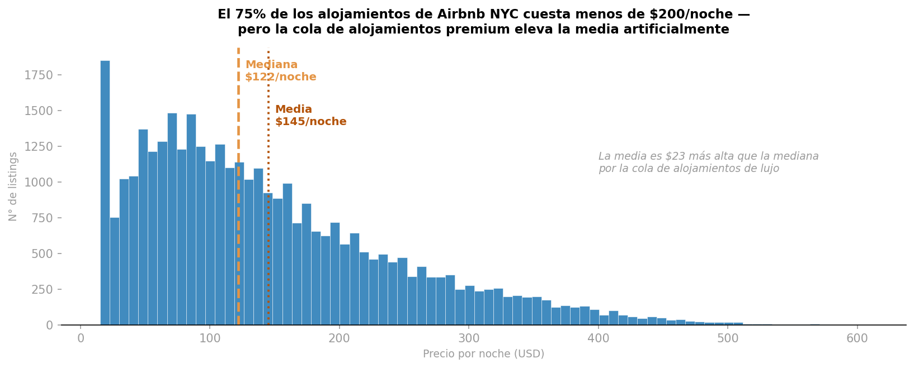
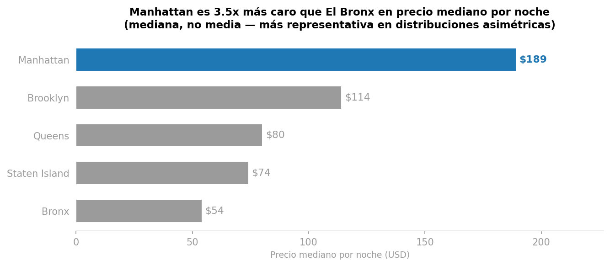
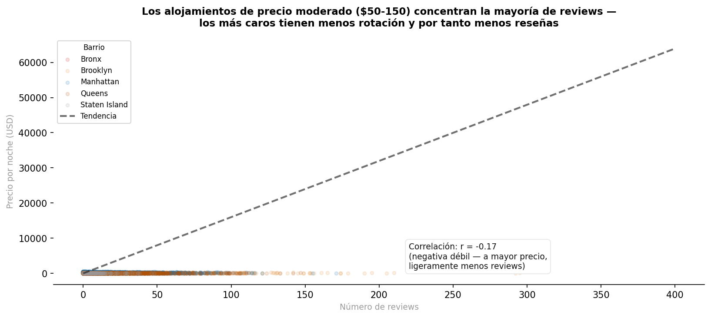
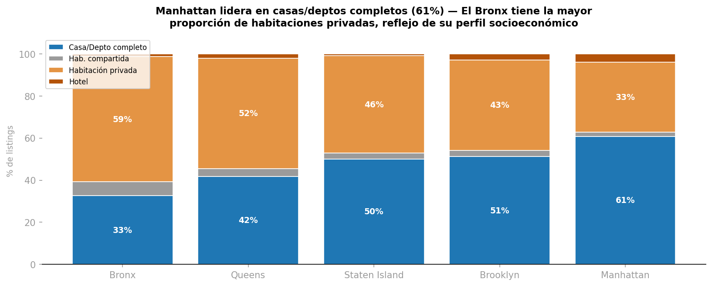
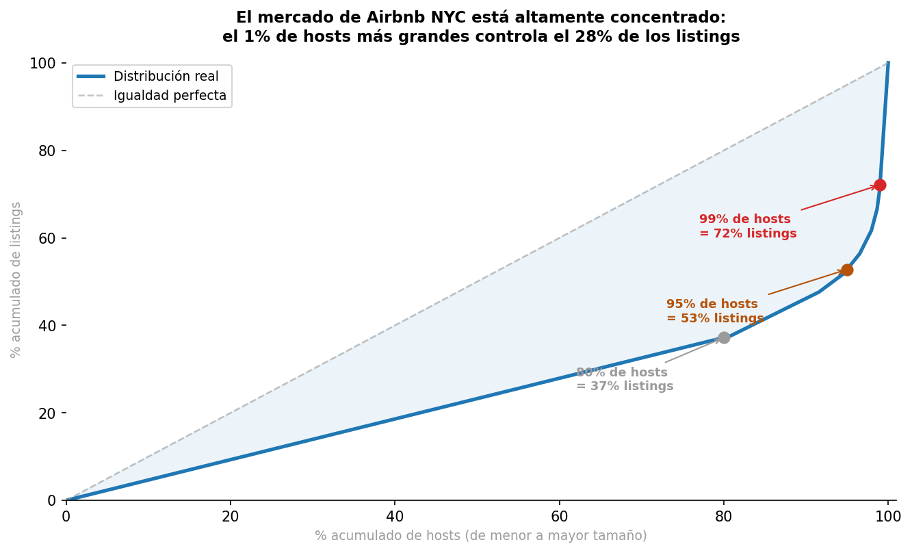

# 5 visualizaciones con datos reales de Airbnb NYC

## Fuente de datos
Datos obtenidos de Inside Airbnb (proyecto independiente, sin afiliación con Airbnb):
http://insideairbnb.com

**Listings de New York City**, snapshot del 2024-09-04:
https://data.insideairbnb.com/united-states/ny/new-york-city/2024-09-04/visualisations/listings.csv

Se da respuesta a 5 preguntas de negocio sobre el mercado de Airbnb en la ciudad de Nueva York aplicando las visualizaciones adecuadas y resaltando insights.

## 1. ¿Cómo se distribuyen los precios por noche en el mercado de Airbnb NYC?

* Hallazgo: La diferencia entre la mediana ($122/noche) y la media ($145/noche) es de $23, la media sobreestima el precio típico
* El 75% de listings cuesta <= $200/noche

## 2. ¿En qué barrio están los alojamientos más caros? ¿Cuánto más caros?

* Precio en Manhattan ($189) es 3.5x del precio de El Bronx: $54, el barrio más económico

## 3. ¿Los alojamientos más baratos acumulan más reviews? ¿Hay un patrón?

* Correlación entre el precio y las reviews es de -0.170
  Es negativa y débil, los alojamientos más caros acumulan menos reviews.
  Es posible que exista una mayor rotación de huéspedes en el segmento económico.

## 4. ¿La mezcla de tipos de alojamiento varía según el barrio?

## 5. ¿El mercado de Airbnb NYC está concentrado en pocos hosts o es atomizado?

* Observamos que el 1% de hosts más grandes controla el 28% del total de listings.
  El 80% de los hosts son hosts individuales con 1 o 2 listings, y controlan solo el 37% del mercado.
  Mercado altamente concentrado con pocos operadores profesionales grandes.

